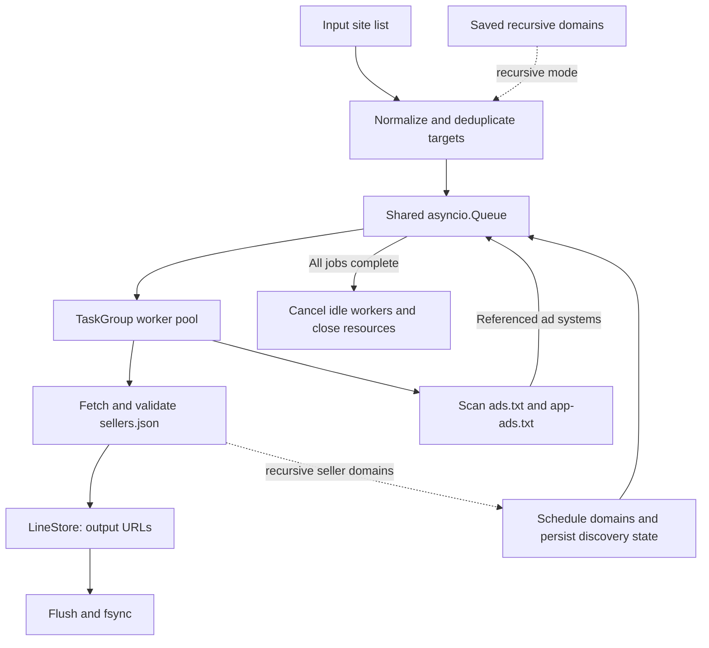

# SPO Sellers.json Crawler

An asynchronous Supply Path Optimization crawler that validates `sellers.json` endpoints, discovers advertising partners, and persists a deduplicated collection of working URLs.

[](#prerequisites)
[](requirements.txt)
[](#tech-stack--architecture)
[](#testing)

The default workflow checks an explicit site list and appends verified endpoints to `exchanges.txt`. Optional discovery modes traverse `ads.txt`, `app-ads.txt`, and `sellers[].domain` relationships without modifying the original input file.

> [!NOTE]
> These badges describe runtime requirements, architecture, and the current test inventory. They are not live CI status or coverage reports. The repository does not currently provide a release version, CI workflow, or license file.

## Table of Contents

- [Features](#features)
- [Tech Stack & Architecture](#tech-stack--architecture)
  - [Core Dependencies](#core-dependencies)
  - [Project Structure](#project-structure)
  - [Key Design Decisions](#key-design-decisions)
- [Getting Started](#getting-started)
  - [Prerequisites](#prerequisites)
  - [Installation](#installation)
- [Testing](#testing)
- [Deployment](#deployment)
- [Usage](#usage)
- [Configuration](#configuration)
- [License](#license)
- [Support the Project](#support-the-project)

## Features

- **Direct endpoint verification:** check every target from a user-maintained site list, independently of whether the site publishes an ads file.
- **Three crawl modes:** direct verification, ads-based partner discovery, and recursive seller-domain discovery.
- **Explicit endpoint support:** retain paths and query strings for input URLs ending in `/sellers.json`, including CDN and vendor-specific locations.
- **Hostname normalization:** normalize hostname case and trailing dots, preserve `www.`, and convert internationalized hostnames to ASCII IDNA representation.
- **Input validation:** reject IP addresses, embedded credentials, unsupported URL schemes, malformed hostnames, whitespace, and unsupported ports.
- **Comment-aware input:** accept UTF-8 files, UTF-8 byte order marks, blank lines, and `#` comments.
- **Deduplication before scheduling:** enqueue each unique hostname/endpoint target once and each ads scan once per hostname.
- **Asynchronous I/O:** share one `aiohttp.ClientSession` and connection pool across a configurable worker pool.
- **Portable DNS resolution:** use threaded DNS resolution without platform-specific event loop policy overrides or a required `aiodns` dependency.
- **Verified HTTPS:** attempt HTTPS first with certificate validation enabled; optionally fall back to HTTP.
- **HTTPS-only mode:** disable HTTP fallback and block redirects to HTTP before issuing a downgraded request.
- **Bounded redirects:** follow at most five redirects per request attempt and persist the final resolved URL.
- **Complete response consumption:** read response chunks until EOF rather than assuming one read contains the complete document.
- **Decoded body limits:** enforce separate limits for sellers and ads files, including chunked and compressed responses.
- **Structural JSON validation:** require valid UTF-8 JSON containing a top-level object and a `sellers` array of objects; reject unrelated JSON and nonstandard numeric constants.
- **Responsive JSON parsing:** offload JSON parsing to a worker thread through `asyncio.to_thread()`.
- **Transient failure recovery:** retry HTTP `408`, `429`, `500`, `502`, `503`, and `504`, transport failures, incomplete payloads, and timeouts.
- **Controlled backoff:** use exponential retry delays with jitter; support numeric and HTTP-date `Retry-After` values with a bounded maximum delay.
- **Ads parsing:** recognize valid advertising-system rows with `DIRECT` or `RESELLER` relationships, plus `OWNERDOMAIN` and `MANAGERDOMAIN` declarations.
- **Cycle-safe recursive traversal:** track direct and discovery jobs in one queue so recursive relationships converge without a separate global work counter.
- **Explicit traversal ceiling:** cap the number of unique sellers targets to limit queue growth during broad discovery runs.
- **Separate recursive state:** persist discovered seller domains independently of the original seed list and load them on subsequent recursive runs.
- **Append-only persistence:** preserve historical results and append only URLs absent from the current output deduplication set.
- **Immediate persistence:** flush and `fsync()` each new URL or discovery batch before acknowledging the write.
- **Process-level output locking:** prevent concurrent writers from using the same output or recursive state file.
- **Path collision protection:** reject overlapping input, output, discovery, and generated lock paths, including existing hard-link aliases.
- **Structured cancellation:** use `asyncio.TaskGroup` to cancel sibling workers when an unexpected worker exception occurs.
- **Graceful CLI interruption:** support `Ctrl+C` and `SIGTERM` cancellation, with cleanup of owned tasks, connections, files, and locks.
- **Operational diagnostics:** emit periodic progress summaries and optional per-request debug messages using Python's standard `logging` module.
- **Offline regression coverage:** exercise normalization, persistence, HTTP behavior, recursive traversal, and failure handling with temporary files and local HTTP servers.

> [!IMPORTANT]
> Verification is structural, not a complete IAB compliance audit. A successful check does not validate every required seller field, confirm a commercial relationship, or establish that a saved URL will remain available in the future.

## Tech Stack & Architecture

### Core Dependencies

| Component | Technology | Responsibility |
| --- | --- | --- |
| Runtime | Python 3.11+ | CLI execution, filesystem access, parsing, and application orchestration |
| Concurrency | `asyncio`, `TaskGroup`, `Queue`, `Runner` | Worker lifecycle, dynamic scheduling, cancellation, and event loop management |
| HTTP client | `aiohttp>=3.13,<4` | Connection pooling, DNS resolution, TLS, proxy support, and streaming responses |
| Document parsing | Standard-library `json` | UTF-8 JSON decoding and sellers document validation |
| Data models | Standard-library `dataclasses` | Immutable configuration and target definitions; mutable runtime statistics |
| CLI | Standard-library `argparse` | Flags, usage output, and configuration validation |
| Diagnostics | Standard-library `logging` | Startup, progress, completion, and debug output |
| Persistence | `pathlib`, `os.fsync`, `msvcrt` / `fcntl` | File access, flushed writes, and platform-specific OS file locks |
| Tests | `unittest`, `unittest.mock`, `aiohttp.web` | Unit tests and isolated HTTP/pipeline integration tests |

`aiohttp` is the only direct third-party runtime dependency. Its transitive dependencies are installed automatically by pip. No database, message broker, Node.js runtime, Docker installation, or remote service account is required.

### Project Structure

```text
SPO-Seller-pipeline-crawler/
├── crawler.py                  # CLI, configuration, HTTP, persistence, and workers
├── requirements.txt            # Runtime dependency constraint
├── README.md                   # Main project documentation
├── publishers.txt              # Existing seed list; read-only during a crawl
├── ALLSSP.md                   # Existing plain-text list of explicit endpoints
├── cmd_commands.txt            # Windows and Unix command reference
├── .gitignore                  # Excludes environment, cache, logs, and generated state
├── docs/
│   ├── readme.md                # Documentation entry point
│   ├── instructions.md          # Operations and troubleshooting guide
│   └── documentation.md         # Architecture and reliability notes
└── tests/
    └── test_crawler.py          # 32 regression tests
```

<details>
<summary>Generated files and runtime state</summary>

The following files or directories may appear after installation or execution:

| Artifact | Creation condition | Purpose |
| --- | --- | --- |
| `.venv/` | Virtual environment setup | Isolated Python interpreter and dependencies |
| `__pycache__/` | Python execution or compilation | Bytecode cache |
| `exchanges.txt` | A run opens the default output collection | Cumulative list of verified final URLs |
| `exchanges.txt.lock` | The default output lock is acquired | Persistent lock filename backed by an OS lock |
| `discovered_publishers.txt` | Recursive mode opens the default state file | Seller-domain discoveries retained for subsequent runs |
| `discovered_publishers.txt.lock` | Recursive state locking | Prevents concurrent writers to recursive state |
| `crawler.log` | Explicit shell redirection or logging configuration | Optional operational log; not created automatically |

Custom output and discovery paths receive corresponding `.lock` files. A lock file remaining after process exit is normal: the OS lock is released when its file handle closes.

</details>

### Key Design Decisions

**One dynamically expanding work queue.** Sellers checks and ads scans share the same `asyncio.Queue`. Workers enqueue any derived jobs before marking their current job complete. Therefore, `queue.join()` includes recursive descendants and returns only after the entire scheduled workload drains.

**Deduplication before I/O.** Scheduling sets are updated synchronously, with no intervening `await` between membership checks and insertion. Cooperative scheduling cannot interleave another coroutine inside that operation. The target ceiling limits accepted sellers jobs; ads jobs are additionally deduplicated by hostname.

**Structured task ownership.** `TaskGroup` owns every worker and the progress logger. Unexpected exceptions propagate and cancel sibling tasks instead of leaving a dead worker or orphaned output queue running indefinitely.

**Direct, acknowledged writes.** Workers append validated results through `LineStore`. Writes are flushed and synced before the store updates its in-memory deduplication set. Disk failures propagate to the task group; there is no independent writer coroutine whose failure could strand producers.

**Reverification on every run.** Existing output prevents duplicate appends, but does not suppress network checks. Recursive state supplies additional seeds rather than functioning as a cache of completed requests.

<details>
<summary>Data flow diagram and traversal semantics</summary>



| Mode | Seed sellers checks | Seed ads scans | Referenced ad-system checks | Follow seller domains |
| --- | --- | --- | --- | --- |
| Default | Yes | No | No | No |
| `--discover` | Yes | Yes | Yes | No |
| `--recursive` | Yes | Yes | Yes | Yes |

In recursive mode, newly encountered seller domains are also eligible for ads scans. A domain previously encountered as an ad system can acquire an ads job later without duplicating its already scheduled root sellers target.

The shared queue is unbounded at the queue implementation level to avoid blocking producers inside a traversal cycle. Application-level scheduling is bounded by `--max-domains`: at most one sellers job per accepted target and one ads job per associated hostname can be scheduled. This ceiling does not bound the historical output collection or total process memory.

</details>

## Getting Started

### Prerequisites

- **Python 3.11 or later**, with pip and virtual environment support.
- **Windows, Linux, or macOS.** The implementation uses platform-specific file locking and otherwise portable Python APIs.
- **Outbound DNS and HTTP connectivity**, including access to TCP ports 443 and, when fallback is enabled, 80.
- **Readable UTF-8 input files** and a writable output directory.
- **Git**, if installing from a repository clone; alternatively, use a downloaded source archive.

### Installation

Replace the example repository URL below with the actual URL of your repository. A canonical remote URL has not been configured in the provided checkout.

**Windows PowerShell**

```powershell
# Clone the source and enter the project directory.
git clone "https://github.com/YOUR_ACCOUNT/YOUR_REPOSITORY.git" spo-sellers-json-crawler
Set-Location spo-sellers-json-crawler

# Create an isolated environment and install runtime dependencies.
python -m venv .venv
.\.venv\Scripts\python.exe -m pip install -r requirements.txt

# Verify installation and inspect supported flags.
.\.venv\Scripts\python.exe -m pip check
.\.venv\Scripts\python.exe crawler.py --help
```

**Linux / macOS**

```bash
# Clone the source and enter the project directory.
git clone "https://github.com/YOUR_ACCOUNT/YOUR_REPOSITORY.git" spo-sellers-json-crawler
cd spo-sellers-json-crawler

# Create an isolated environment and install runtime dependencies.
python3 -m venv .venv
.venv/bin/python -m pip install -r requirements.txt

# Verify installation and inspect supported flags.
.venv/bin/python -m pip check
.venv/bin/python crawler.py --help
```

Already working from a local copy? Start with the virtual environment step. There is no package build step: the entry point is `crawler.py` in the source checkout.

> [!TIP]
> Using the environment's interpreter directly avoids activation requirements and PowerShell execution-policy issues associated with activation scripts.

<details>
<summary>Alternative installation and environment troubleshooting</summary>

**Source archive installation.** Download and extract the repository archive, open a terminal in the extracted project folder, and run the same environment and dependency commands. Git is unnecessary for this method.

**Multiple Python installations.** Confirm the interpreter version before creating the environment:

```powershell
python --version
py --list

# Example: explicitly select Python 3.14 if it is installed.
py -3.14 -m venv .venv
```

On Unix, use an explicit available interpreter such as `python3.11` or `python3.14` when `python3` points to an older version.

**Copied or relocated virtual environments.** A virtual environment can retain paths to an interpreter on another machine. If it reports a missing executable, recreate it using an installed supported Python interpreter and reinstall requirements:

```powershell
python -m venv .venv
.\.venv\Scripts\python.exe -m pip install -r requirements.txt
```

For a completely separate environment, create `.venv-new` and substitute that name in all interpreter paths.

**Missing Unix venv support.** Some Linux distributions package virtual environment support separately. Install the Python venv package appropriate to your distribution and interpreter before retrying environment creation.

**Dependency import failures.** Use the same interpreter for pip and execution. A successful global `pip install` does not install a package into every virtual environment.

**TLS trust or corporate proxy issues.** Configure trusted certificates and proxy environment variables for your environment. The crawler does not disable TLS validation to bypass certificate failures. See [Configuration](#configuration) for proxy settings.

</details>

## Testing

The current suite contains **32 tests** across three groups. Tests use temporary files, mocked failures, and ephemeral local HTTP servers; they do not require public websites or external accounts.

Run the complete suite from the project root:

```powershell
# Windows: treat Python warnings as test failures.
.\.venv\Scripts\python.exe -W error -m unittest discover -s tests -v
```

```bash
# Linux/macOS: run the same strict suite.
.venv/bin/python -W error -m unittest discover -s tests -v
```

<details>
<summary>Unit tests, integration tests, syntax checks, and optional linting</summary>

**Unit tests: input, schema validation, configuration, storage, locks, and CLI orchestration**

```powershell
.\.venv\Scripts\python.exe -m unittest discover -s tests -k InputAndStorageTests -v
```

**HTTP integration tests: streaming, redirects, retry budgets, rate limiting, TLS failures, timeouts, incomplete payloads, and decoded size limits**

```powershell
.\.venv\Scripts\python.exe -m unittest discover -s tests -k HttpTests -v
```

**Pipeline integration tests: crawl modes, recursive cycles, target ceilings, recursive state, disk failures, cancellation, and rerun deduplication**

```powershell
.\.venv\Scripts\python.exe -m unittest discover -s tests -k PipelineTests -v
```

On Unix, replace `.\.venv\Scripts\python.exe` with `.venv/bin/python`.

**Dependency consistency and bytecode compilation**

```powershell
.\.venv\Scripts\python.exe -m pip check
.\.venv\Scripts\python.exe -m compileall -q crawler.py tests
```

Compilation catches syntax errors; it is not a linter or a type checker.

**Optional Ruff checks**

The repository does not currently provide a lint configuration or development dependency file. Install Ruff separately when you want static checks, then run this explicit error-focused baseline:

```powershell
.\.venv\Scripts\python.exe -m pip install ruff
.\.venv\Scripts\python.exe -m ruff check --isolated --no-cache --target-version py311 --select E9,F63,F7,F82 crawler.py tests
```

`--isolated` prevents an unrelated user or parent-directory configuration from changing the selected checks. This command checks selected syntax and correctness rules; it does not impose a complete style policy or measure test coverage. See the [Ruff configuration reference](https://docs.astral.sh/ruff/configuration/) for extending the rule set.

No coverage percentage is published. The static test-count badge must be updated when tests are added or removed.

</details>

## Deployment

Deploy the source checkout and its Python environment to a host with outbound network access and persistent writable storage. There is no compiled application artifact, listening HTTP service, or required container image.

For an explicit production invocation on Unix:

```bash
# Keep input, output, and recursive state paths explicit.
.venv/bin/python crawler.py \
  --input /var/lib/spo-crawler/publishers.txt \
  --output /var/lib/spo-crawler/exchanges.txt \
  --discovered-file /var/lib/spo-crawler/discovered_publishers.txt \
  --recursive \
  --concurrency 5 \
  --timeout 30 \
  --max-domains 50000
```

Run the process under an account that can read its seed file and write to the state directory. Use a foreground terminal, a terminal session manager, or a process supervisor according to your operational requirements.

The repository dependency constraint is bounded but unpinned. For reproducible deployments, resolve dependencies in a clean environment, retain the resolved versions with your deployment artifacts, and verify the same versions before rollout.

> [!IMPORTANT]
> Recursive output and state must survive deployment replacement. Multiple instances require separate output and discovery paths. Cooperative OS locks prevent shared writers but do not make a distributed shared-storage deployment automatically safe.

<details>
<summary>Linux process supervision with systemd</summary>

The following is an example deployment configuration, not a service file bundled with the repository. Provision the `spo-crawler` account, place the checkout at `/opt/spo-sellers-json-crawler`, create its virtual environment, and populate `/var/lib/spo-crawler/publishers.txt` before enabling the service.

Save this unit as `/etc/systemd/system/spo-crawler.service`:

```ini
[Unit]
Description=SPO Sellers.json Crawler
Wants=network-online.target
After=network-online.target

[Service]
Type=simple
User=spo-crawler
Group=spo-crawler
WorkingDirectory=/opt/spo-sellers-json-crawler
Environment=PYTHONUNBUFFERED=1
ExecStart=/opt/spo-sellers-json-crawler/.venv/bin/python /opt/spo-sellers-json-crawler/crawler.py \
    --input /var/lib/spo-crawler/publishers.txt \
    --output /var/lib/spo-crawler/exchanges.txt \
    --discovered-file /var/lib/spo-crawler/discovered_publishers.txt \
    --recursive --concurrency 5 --timeout 30 --max-domains 50000
Restart=no
SuccessExitStatus=130
KillSignal=SIGTERM
TimeoutStopSec=300

[Install]
WantedBy=multi-user.target
```

```bash
sudo systemctl daemon-reload
sudo systemctl enable --now spo-crawler.service
sudo journalctl -u spo-crawler.service -f

# Send SIGTERM and allow the supervisor to wait for cleanup.
sudo systemctl stop spo-crawler.service
```

This unit performs one crawl when started and does not restart automatically after completion or failure. Review operational failures before starting another run. To run repeated campaigns, configure scheduling separately and account for the output locks and cumulative result semantics.

</details>

<details>
<summary>Portable CI validation steps</summary>

No CI workflow is committed. The following Unix shell steps can be placed in a pipeline job after checking out the repository and provisioning a supported Python interpreter:

```bash
set -eu

python3 -m venv .venv
.venv/bin/python -m pip install -r requirements.txt
.venv/bin/python -m pip check
.venv/bin/python -W error -m unittest discover -s tests -v
.venv/bin/python -m compileall -q crawler.py tests
```

For optional lint validation, add the explicitly documented Ruff installation and command from [Testing](#testing). Keep lint tooling separate from runtime-only deployment environments.

CI should run the isolated test suite rather than a full public-web crawl. A public crawl depends on remote availability, response timing, certificate state, and rate limits, so its results are unsuitable as deterministic merge checks.

</details>

<details>
<summary>Background terminal sessions and log capture</summary>

On a Unix host with `tmux` installed:

```bash
tmux new -s spo-crawler
.venv/bin/python crawler.py --recursive
```

Detach with `Ctrl+B`, then `D`; reconnect with `tmux attach -t spo-crawler`.

For PowerShell log capture while preserving console output:

```powershell
.\.venv\Scripts\python.exe crawler.py 2>&1 | Tee-Object -FilePath crawler.log
```

The CLI emits standard logging output to stderr. Output URL collections are separate data files, not log files.

</details>

## Usage

Create or edit `publishers.txt` with one target per line:

```text
# Domains and ordinary site URLs use /sellers.json.
example.com
www.example.org
https://example.net/news

# Explicit sellers.json URLs preserve this path and query string.
https://cdn.example.com/Case/sellers.json?region=eu
```

Start a direct scan:

```powershell
# Check only the supplied sites and append newly verified URLs.
.\.venv\Scripts\python.exe crawler.py

# Use a separate collection for a new campaign.
.\.venv\Scripts\python.exe crawler.py --input sites.txt --output campaign_results.txt
```

On Unix, use `.venv/bin/python crawler.py` with the same flags.

Each successful target contributes its final resolved endpoint URL to the output collection. Results are written as requests complete, so output order is not guaranteed to match input order.

> [!WARNING]
> Output is cumulative. Previously saved URLs remain even if a later check fails. Use a new `--output` filename when you need a fresh snapshot of that run's successful checks; existing files are never automatically truncated or pruned.

<details>
<summary>Advanced Usage: discovery modes and campaign isolation</summary>

**Discover ad systems referenced by the seed sites**

```powershell
# Scan seed ads.txt and app-ads.txt files, then check referenced ad systems.
.\.venv\Scripts\python.exe crawler.py --discover
```

This mode does not follow `sellers[].domain` values and does not scan every referenced ad system's ads files recursively.

**Follow seller domains recursively**

```powershell
# --recursive also enables ads scans for seed and discovered publisher domains.
.\.venv\Scripts\python.exe crawler.py --recursive --max-domains 50000
```

New seller domains are saved separately in `discovered_publishers.txt`. Subsequent recursive runs load that file alongside the input list and recheck the combined targets.

**Keep campaign state independent**

```powershell
.\.venv\Scripts\python.exe crawler.py `
    --input campaign_a_sites.txt `
    --output campaign_a_results.txt `
    --discovered-file campaign_a_domains.txt `
    --recursive `
    --concurrency 5
```

Separate both output and recursive state paths when running independent campaigns. Sharing a discovery file also shares its seed history and lock.

**Check the provided explicit endpoint inventory**

```powershell
# ALLSSP.md is a plain list of endpoint URLs despite its .md extension.
.\.venv\Scripts\python.exe crawler.py --input ALLSSP.md --output ssp_results.txt
```

**Limit transport behavior and inspect failures**

```powershell
# Require HTTPS, allow slower responses, and log rejected requests/documents.
.\.venv\Scripts\python.exe crawler.py --https-only --timeout 30 --verbose

# Inspect all supported arguments without making network requests.
.\.venv\Scripts\python.exe crawler.py --help
```

</details>

<details>
<summary>Advanced Usage: Python integration and logging customization</summary>

The source module exposes `Config`, `run()`, and `Stats` for use from an existing Python application. This is a source-level API; the repository does not currently ship an installable Python package or declare a versioned public API compatibility policy.

```python
import asyncio
import logging
from dataclasses import asdict
from pathlib import Path

from crawler import Config, run


async def main() -> None:
    # The caller owns logging configuration when using run() directly.
    logging.basicConfig(
        level=logging.INFO,
        format="%(asctime)s %(levelname)s %(name)s %(message)s",
        handlers=[
            logging.StreamHandler(),
            logging.FileHandler("crawler.log", encoding="utf-8"),
        ],
    )

    config = Config(
        input_file=Path("sites.txt"),
        output_file=Path("results.txt"),
        concurrency=5,
        timeout=30.0,
        retries=2,
        https_only=True,
    )

    # run() validates configuration, manages crawl resources, and returns statistics.
    stats = await run(config)
    print(asdict(stats))


if __name__ == "__main__":
    asyncio.run(main())
```

Within an application that already owns an event loop, call `await run(config)` instead of nesting `asyncio.run()`.

The `crawler` logger uses standard Python logging handlers and formatters. To debug an embedded run, configure the logger or root logger at `DEBUG`; `Config.verbose` is not consumed by `run()` to configure logging. The CLI's `--verbose` flag configures logging in `main()`.

CLI-specific `Ctrl+C`/`SIGTERM` setup is handled by `main()`. Embedded callers are responsible for their own signal policy and should cancel the task awaiting `run()` when shutdown is requested. Task cancellation propagates through the owned crawl resources.

`Stats` fields include `targets_checked`, `sellers_found`, `new_urls`, `ads_checked`, `new_domains`, `requests`, `retries`, and `limit_reached`. `requests` counts top-level fetch attempts, including retries and protocol fallback; it does not count every redirect hop. Multiple targets resolving to the same URL can increase `sellers_found` while `new_urls` remains lower. `new_domains` counts newly encountered domains in the current traversal, not necessarily newly appended state-file lines.

</details>

<details>
<summary>Edge Cases: input normalization and successful document checks</summary>

| Input or response | Behavior |
| --- | --- |
| `Example.COM` | Normalized to `example.com` |
| `www.example.com` | Preserved as a separate hostname; `www.` is not stripped |
| `https://example.com/news?section=ads` | Uses the hostname and checks `/sellers.json` |
| `https://cdn.example.com/Case/sellers.json?Key=A` | Retains the path and query string; hostname is normalized |
| `http://example.com/sellers.json` | Preserves the endpoint; candidates still begin with HTTPS |
| `https://example.com:443/` / `http://example.com:80/` | Matching explicit default ports are accepted and normalized away |
| A bare hostname with a port | Rejected; default-port acceptance requires the matching explicit scheme |
| A non-default port or mismatched scheme/port | Rejected |
| A URL with credentials, an IP address, or an unsupported scheme | Rejected |
| A URL containing literal whitespace | Rejected; encode URL path spaces where necessary |
| An internationalized hostname | Converted to IDNA before hostname validation |
| A custom path ending in `/sellers.json/` | Not treated as an explicit sellers endpoint; uses the root path instead |
| Empty lines, full-line comments, inline `#` comments | Ignored or stripped during input loading |
| Duplicate hostnames with different explicit sellers paths | Treated as separate targets |
| HTTP 200 with HTML/XML content type | Rejected before JSON parsing |
| HTTP 200 with unrelated JSON, such as `{}` | Rejected because it lacks a sellers array |
| `{"sellers": []}` | Accepted; an empty seller list is structurally valid |
| A seller array containing a non-object entry | Rejected |
| Missing seller IDs, names, types, or version | Not audited by this structural validator |
| A seller object's missing or invalid `domain` | Ignored for recursive discovery |
| UTF-8 JSON with a BOM | Accepted |
| Invalid UTF-8, malformed JSON, `NaN`, or `Infinity` | Rejected |
| A redirected endpoint without a `sellers.json` filename | Accepted if the final response passes document validation |

Hostname validation checks syntax; it does not consult a public suffix registry or verify registration before requesting the hostname. The crawler does not guess alternative CDN paths or subdomains beyond those explicitly supplied or discovered from documents.

</details>

<details>
<summary>Edge Cases: interruptions, historical output, and troubleshooting</summary>

**Graceful shutdown.** Press `Ctrl+C` once. On Unix, `SIGTERM` also requests cancellation. File and network cleanup occurs through the owned context managers and task group. OS DNS calls or an already executing parser thread may require time to finish during interpreter cleanup; the CLI does not promise a fixed one-second shutdown deadline.

**Forced termination.** Task Manager force termination, `SIGKILL`, and power loss cannot execute Python cleanup handlers. Synced records remain available, but termination during an append may leave a partial final line. Existing invalid lines are reported and preserved; a missing trailing newline is repaired before subsequent appends.

**Rerun semantics.** Rerunning checks all input targets again and deduplicates against previous output. Recursive state is a set of additional discovered seeds, not a serialized queue or a complete record of completed/failed requests. Existing duplicate output lines are not rewritten or removed.

**No endpoints found.** Many publisher sites publish ads files without hosting their own sellers.json. Use `--discover` and a small sample to investigate, then enable `--verbose` for request and parsing failures.

**Large feeds.** Raise `--max-sellers-mb` if you intend to accept larger bodies, and lower concurrency if memory is constrained. Limits apply to decoded body bytes, while parsed objects, decompression buffers, threads, deduplication sets, and historical output consume additional memory.

**Target ceiling.** If discovery reaches `--max-domains`, a warning is emitted and additional new targets are skipped. Already accepted work drains normally. This can still produce exit code `0`; inspect logs or `Stats.limit_reached` when completeness matters. If the initial combined input and recursive state exceed the ceiling, startup fails instead of silently truncating them.

**Lock acquisition failure.** Confirm that another process is not writing to the same output or discovery collection and that the lock directory is writable. A leftover `.lock` file is not proof that an OS lock remains held.

**Disk or permission failure.** Correct the storage issue before restarting. Unexpected output failures stop the crawl with a nonzero exit code rather than dropping discoveries or hanging the writer.

**Connection failures or rate limits.** Reduce `--concurrency`, increase `--timeout`, or adjust `--retries`. Missing files, rejected documents, certificate failures, and exhausted transport attempts are individual failed checks, not necessarily whole-run failures.

| Exit code | Meaning |
| --- | --- |
| `0` | Scheduled crawl completed; individual failed sites or a reached discovery ceiling may still exist |
| `1` | Runtime failure, including input I/O, locking, persistence, or unexpected worker failure |
| `2` | Invalid CLI arguments or configuration rejected by argparse |
| `130` | Graceful CLI interruption through cancellation or `Ctrl+C` |

</details>

## Configuration

The application supports **CLI arguments** and the Python **`Config` dataclass**. Process environment variables provide proxy and interpreter configuration.

Default data-file paths are resolved relative to `crawler.py`, regardless of the launching directory. Explicit relative paths are resolved against the process working directory. All files used together must be distinct from one another and from generated lock paths.

> [!NOTE]
> There is no application configuration-file loader, `.env` loader, or JSON/YAML schema. Supplying a `.env`, `config.json`, or `config.yaml` file does not configure the crawler. Export environment variables in the shell or inject them through your process supervisor.

<details>
<summary>Complete CLI configuration reference</summary>

| Flag | Type | Default | Meaning |
| --- | --- | --- | --- |
| `--input` | Path | `publishers.txt` beside the script | UTF-8 input list of sites or explicit sellers endpoints |
| `--output` | Path | `exchanges.txt` beside the script | Append-only collection of final validated URLs |
| `--concurrency` | Positive integer | `10` | Worker count and shared connection-pool limit |
| `--timeout` | Positive finite seconds | `20` | Deadline per candidate attempt, including redirects and body consumption |
| `--retries` | Non-negative integer | `2` | Additional attempts after the initial request for retryable failures |
| `--max-sellers-mb` | Positive finite MiB | `50` | Maximum decoded sellers response size; converted to bytes |
| `--max-ads-mb` | Positive finite MiB | `5` | Maximum decoded ads response size; converted to bytes |
| `--max-domains` | Positive integer | `100000` | Maximum unique hostname/endpoint sellers targets accepted for scheduling |
| `--discover` | Boolean switch | Disabled | Scan seed ads files and verify referenced ad systems |
| `--recursive` | Boolean switch | Disabled | Follow seller domains and scan their ads files; includes seed ads discovery |
| `--discovered-file` | Path | `discovered_publishers.txt` beside the script | Recursive state input/output; used only in recursive mode |
| `--https-only` | Boolean switch | Disabled | Disable HTTP candidates and reject HTTP redirects before requesting them |
| `--progress-interval` | Positive finite seconds | `15` | Delay between periodic progress summaries |
| `--verbose` | Boolean switch | Disabled | Configure CLI logging at DEBUG, including individual request/document failures |
| `-h`, `--help` | Switch | N/A | Print argument documentation and exit without a crawl |

`--max-domains` counts targets rather than registered domains: two explicit sellers endpoints on the same hostname consume two target slots. Ads scans are limited separately to one per hostname.

Body limits use MiB: `1 MiB = 1,048,576 bytes`. A positive decimal size that rounds down to zero bytes is rejected during configuration validation. Zero, negative, `NaN`, and infinite values are invalid for positive numeric settings; retries may be zero.

</details>

<details>
<summary>Full Python Config defaults and internal transport settings</summary>

| `Config` field | Default | Unit / behavior |
| --- | --- | --- |
| `input_file` | `PROJECT_DIR / "publishers.txt"` | `pathlib.Path` |
| `output_file` | `PROJECT_DIR / "exchanges.txt"` | `pathlib.Path` |
| `discovered_file` | `PROJECT_DIR / "discovered_publishers.txt"` | `pathlib.Path`; active in recursive mode |
| `concurrency` | `10` | Workers |
| `timeout` | `20.0` | Seconds |
| `retries` | `2` | Additional attempts per candidate URL |
| `retry_backoff` | `1.0` | Initial retry delay in seconds; zero is allowed |
| `max_retry_delay` | `60.0` | Maximum backoff or Retry-After delay in seconds |
| `max_sellers_bytes` | `50 * 1024 * 1024` | Decoded bytes |
| `max_ads_bytes` | `5 * 1024 * 1024` | Decoded bytes |
| `max_domains` | `100_000` | Unique sellers targets |
| `discover` | `False` | Enable seed ads discovery |
| `recursive` | `False` | Enable seller-domain traversal and state persistence |
| `https_only` | `False` | Disable HTTP fallback and downgrade redirects |
| `progress_interval` | `15.0` | Seconds between progress logs |
| `verbose` | `False` | Stored configuration field; embedded callers configure logging themselves |

`Config` is a frozen dataclass. Retry backoff and maximum retry delay can be changed through the Python API; they do not have CLI flags.

Additional source-level settings:

| Setting | Value / behavior |
| --- | --- |
| User-Agent | `SellersJsonCrawler/2.0`; this is a client identifier, not a repository release version |
| Connection limit | Equal to configured worker concurrency |
| Per-host connection limit | `2` |
| DNS cache TTL | `300` seconds |
| DNS resolver | `aiohttp.ThreadedResolver` |
| Connect timeout | `min(10.0, timeout)` seconds; includes acquiring a pooled connection |
| Socket-read timeout | Configured `timeout` |
| Redirect limit | Five redirects per attempt |
| Streaming chunk size | `64 * 1024` bytes |
| Cookies | `aiohttp.DummyCookieJar`; cookies are not persisted |
| Environment proxy support | `trust_env=True` |
| Rejected media types | `text/html`, `application/xhtml+xml`, `application/xml`, `text/xml` |
| Default sellers Accept header | `application/json, text/plain;q=0.9, */*;q=0.1` |
| Ads Accept header | `text/plain, */*;q=0.1` |

</details>

<details>
<summary>Environment variables and proxy configuration</summary>

| Variable | Scope | Purpose |
| --- | --- | --- |
| `HTTP_PROXY` | aiohttp environment proxy support | Proxy for HTTP requests |
| `HTTPS_PROXY` | aiohttp environment proxy support | Proxy used for HTTPS requests |
| `NO_PROXY` | aiohttp environment proxy support | Hosts or domains excluded from proxy routing |
| `PYTHONUNBUFFERED` | Python interpreter | Set to `1` when unbuffered process streams are useful for supervisors or redirected output |
| `PYTHONUTF8` | Python interpreter | Set to `1` to enable interpreter UTF-8 mode; application data files already specify UTF-8 explicitly |

PowerShell example:

```powershell
# Example proxy addresses; replace them with your actual environment settings.
$env:HTTP_PROXY = "http://proxy.internal:3128"
$env:HTTPS_PROXY = "http://proxy.internal:3128"
$env:NO_PROXY = "localhost,127.0.0.1"

.\.venv\Scripts\python.exe crawler.py
```

Unix example:

```bash
export HTTP_PROXY="http://proxy.internal:3128"
export HTTPS_PROXY="http://proxy.internal:3128"
export NO_PROXY="localhost,127.0.0.1"

.venv/bin/python crawler.py
```

Proxy behavior is delegated to [aiohttp's environment proxy support](https://docs.aiohttp.org/en/stable/client_advanced.html#proxy-support). The crawler does not define environment variables for worker counts, file paths, or body limits; use CLI flags or `Config` for those settings.

</details>

<details>
<summary>Retry, timeout, and memory semantics</summary>

With `--retries 2`, a retryable candidate receives up to three attempts: one initial attempt and two retries. HTTPS and HTTP fallback candidates have separate budgets. The configured timeout applies per attempt, not to the complete target, retry sleeps, JSON parsing, or the entire crawl.

Retryable responses are HTTP `408`, `429`, `500`, `502`, `503`, and `504`. Transport failures, timeouts, and incomplete response payloads are also retryable. Certificate/SSL failures, invalid URLs, redirect-limit errors, permanent statuses, oversized documents, and invalid JSON are not retried on the same candidate; an eligible HTTP fallback can still follow.

The fallback delay is approximately:

```text
min(max_retry_delay, retry_backoff * 2^attempt * jitter)

attempt: zero-based retry index, capped at 16 for exponent calculation
jitter: a random multiplier between 1.0 and 1.25
```

A valid non-negative `Retry-After` value overrides exponential backoff and is capped at `max_retry_delay`. HTTP-date values are converted to a remaining delay; invalid or expired values fall back to normal backoff. Responses are released before sleeping.

Reducing concurrency lowers the number of simultaneous bodies and parsed documents. Increasing body limits enables larger feeds but does not impose a process memory budget: object expansion, decoded buffers, deduplication sets, and historical collections require additional memory.

</details>

Additional operational guidance is available in the [operations guide](docs/instructions.md) and [architecture notes](docs/documentation.md). The external [IAB sellers.json specification](https://iabtechlab.com/wp-content/uploads/2019/07/Sellers.json_Final.pdf) provides the full document requirements beyond this crawler's structural checks.

## License

**License not specified.** This checkout does not include a `LICENSE` or `COPYING` file, and no open-source license has been selected in the project metadata.

> [!IMPORTANT]
> The project does not currently declare MIT, Apache-2.0, GPL-3.0, or another open-source license. The repository owner should select a license, add the corresponding license file, and update this section before publishing explicit reuse or redistribution terms.

## Support the Project

  [](https://devs-in-exile.pages.dev/)
  [](https://www.patreon.com/OstinFCT)
  [](https://ko-fi.com/fctostin)
  [](https://boosty.to/ostinfct)
  [](https://www.youtube.com/@FCT-Ostin)
  [](https://t.me/FCTostin)

If you find this tool useful, consider leaving a star on GitHub or supporting the author directly.
